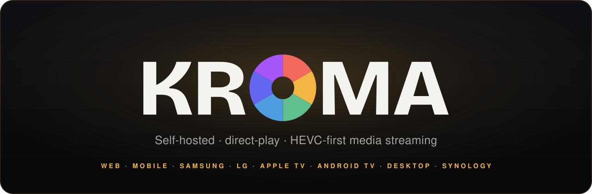
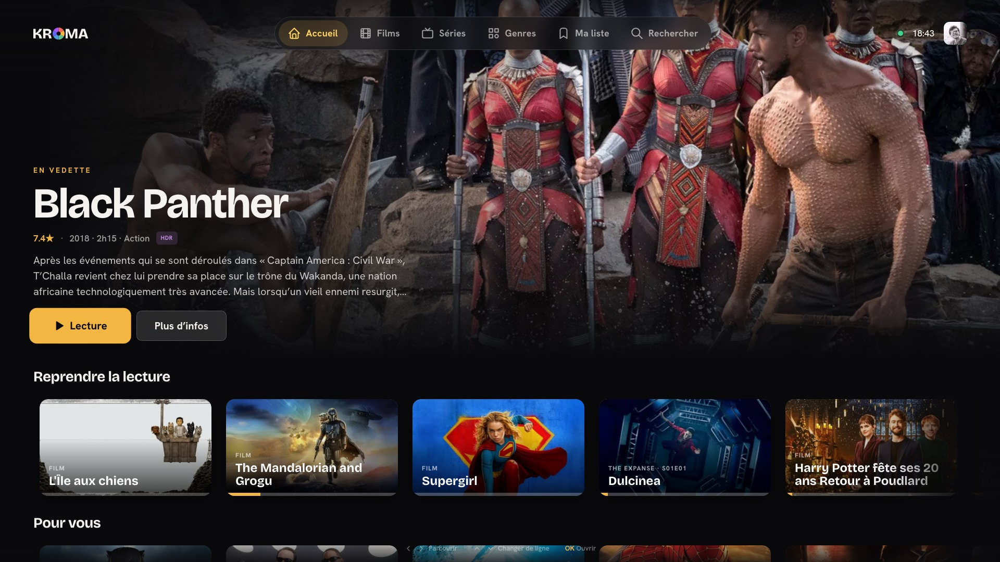
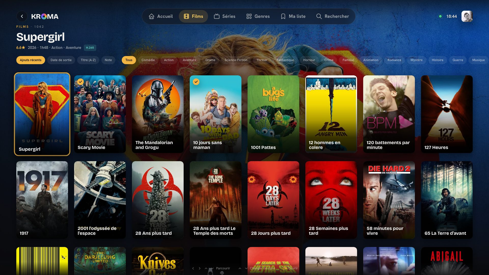

<div align="center">



<br/>

**Your own Netflix, on hardware you own.**
Find it, download it, organize it, stream it. One Rust server for playback and
catalog, and everything else (indexers · torrent engine · VPN + kill switch · AI)
as a module you install in a click. No Sonarr, no Radarr, no Jackett, no
qBittorrent, no Gluetun. **Just KROMA.**

[](https://github.com/maxscharwath/kroma/actions/workflows/ci.yml)
[](https://sonarcloud.io/summary/new_code?id=maxscharwath_kroma)
[](https://sonarcloud.io/component_measures?id=maxscharwath_kroma&metric=coverage)

[](https://sonarcloud.io/summary/new_code?id=maxscharwath_kroma)
[](https://sonarcloud.io/summary/new_code?id=maxscharwath_kroma)
[](https://sonarcloud.io/component_measures?id=maxscharwath_kroma&metric=duplicated_lines_density)
[](https://sonarcloud.io/component_measures?id=maxscharwath_kroma&metric=ncloc)

[](LICENSE)
[](https://bun.sh)
[](https://www.rust-lang.org)
[](https://www.typescriptlang.org)
[](#platforms)
[](CONTRIBUTING.md)

</div>

---

KROMA is a self-hosted, multi-platform **media stack that does the whole job**:
the *arr suite, your indexer aggregator, your torrent client, your VPN wrapper
and your media server, in **one server and a set of first-party modules**.
Turn the modules on and KROMA searches your trackers, scores the releases, grabs
the best one, tunnels it through your VPN behind a kill switch, imports and
renames it Plex-style, enriches it from **TMDB**, and direct-play streams it to
the web, your phone and your living-room TV, wrapped in one calm, cinematic,
amber-on-charcoal design language.

**Nothing to wire together.** Where a typical setup bolts together Sonarr +
Radarr + Prowlarr/Jackett + qBittorrent + Gluetun + Jellyfin + Overseerr (six
containers, six configs, six things that break), KROMA is one process you install
once. The rest are modules: you pick them from the Store inside the app, they
install with one click, and they find each other by capability. No compose file,
no ports to map, no credentials to copy between services.

The trade this makes, said plainly: a fresh install is a **media server**, not a
download stack. Everything past playback and catalog is opt-in.

<div align="center">

|  |  |
| :--: | :--: |
|  |  |
| The generated home | The library, by remote |

</div>

## What the server ships, and what you install

`modules/roster.yaml` is empty on purpose: the server is the **zero-module base
build**. It is a complete media server on its own, and every acquisition feature
is a module you add from Admin → Modules.

**In the server, with nothing installed:**

| | | |
| --- | --- | --- |
| ▶️ **Player** | direct-play, HEVC-first: original files range-streamed, decoded natively | no transcode farm |
| 📚 **Library** | Plex-style scan, movie/show/season/episode grouping, SQLite (WAL) | |
| 🎬 **Metadata** | TMDB overviews, posters, backdrops, genres, ratings, IMDb ids, cached as WebP | built-in key |
| 🔤 **Search** | typo-tolerant fuzzy/prefix matching over titles, cast and genres | in-process, no index server |
| 🏠 **Home** | Continue watching, Recently added, Trending, curated rows | see the note below |
| 📺 **Clients** | web, mobile, Samsung, LG, Apple TV, Android TV, desktop, Synology | one codebase |
| 📱 **Cast & pairing** | start a title on the TV from your phone, then drive it; QR + Quick Connect | no Chromecast needed |
| 👥 **Multi-user** | accounts, profiles, PIN locks, passkeys, invites, per-user permissions | share safely |
| 📨 **Requests** | ask for a title, browse what's wanted | fulfilling one needs the modules below |
| 📊 **Live bus** | scan/library/playback dashboards over a real-time WebSocket | at a glance |
| 🧩 **Module store** | registries, sha256-verified installs, the sidecar supervisor | how the rest arrives |

**Modules, one click from the Store.** The official catalog is
[`modules.kroma.tv/modules.json`](https://modules.kroma.tv/modules.json):

| Module | What it adds | Needs |
| --- | --- | --- |
| 🔎 **Indexers** `tv.kroma.indexer` | native Cardigann engine, running Jackett/Prowlarr tracker definitions directly | - |
| 🔎 **Torznab** `tv.kroma.torznab` | external Torznab/Newznab indexers (Jackett, Prowlarr) | - |
| ⬇️ **Torrent downloads** `tv.kroma.torrents` | the embedded librqbit engine + the download queue | an indexer |
| ⬇️ **qBittorrent** · **Transmission** | those clients as download sub-engines | Torrent downloads |
| 🧠 **Acquisition** `tv.kroma.acquisition` | release search, quality scoring, grab + import, automatic wanted-list | an indexer + a download client |
| 🔒 **VPN** `tv.kroma.vpn` | managed WireGuard→SOCKS5 bridge with a live seal test and kill switch | - |
| ✨ **Embeddings** `tv.kroma.vector` | content embeddings behind For You, themed rows and semantic search | - |
| ✨ **Whisper** `tv.kroma.whisper` | on-device subtitle transcription (candle) | - |
| 🌐 **Remote access** `tv.kroma.remote` | public HTTPS share URL + optional managed Cloudflare Tunnel | - |
| 📡 **mDNS** `tv.kroma.mdns` | DNS-SD advertising so LAN clients find the server automatically | - |
| 🎞️ **Release parser** `tv.kroma.scene` | scene/P2P release-name parsing and scoring | - |

> **The one thing to know about the home screen.** Continue watching, Recently
> added and Trending are plain database rows and always work. **For You and the
> themed/semantic rows need the Embeddings module**. Without it the core's
> embedder resolves to nothing, and those rows are simply not emitted rather than
> breaking the page. The module ships a dependency-free lexical embedder by
> default; a multilingual semantic build is available for better themed rows.

All of it self-hosted, private, and offline-capable: your library and your
activity never leave your network.

> **Playback is direct-play, HEVC-first.** The server never transcodes video: it
> **range-streams the original files** and every client decodes HEVC/H.265 (incl.
> 10-bit / HDR) natively (Samsung & LG TVs in hardware, modern browsers where
> supported), so your NAS CPU stays idle. The one exception is an **audio-only**
> HLS path for browsers that can't decode AC3/EAC3/DTS (video is copied, only the
> audio is re-encoded to stereo AAC).

## Features

- **One fast binary.** The core is a single Rust process (axum + SQLite). It boots
  in milliseconds, idles near-zero CPU, has no JVM, no container orchestra and no
  transcode farm to keep warm.
- **Everything else is a module.** Downloads, indexers, acquisition, VPN, Whisper,
  embeddings, mDNS and remote access ship as **out-of-process `.kmod` sidecars**
  you install from Admin → Modules. Install what you use, uninstall what you don't,
  and update a module without updating the server.
- **A native indexer engine** *(module: Indexers)*. A reimplementation of
  **Cardigann** runs the same community-maintained tracker definitions
  Jackett/Prowlarr use, fetched at runtime, with HTML/JSON/XML scraping, logins
  and Cloudflare (FlareSolverr), so you search real trackers with **no aggregator
  to install**. External Torznab endpoints are their own module and work side by side.
- **An embedded torrent engine** *(module: Torrent downloads)*. A librqbit
  BitTorrent client grabs releases in the module's own process; Transmission and
  qBittorrent plug in as sub-engines.
- **Automatic acquisition** *(module: Acquisition)*. Request a movie or show and
  KROMA searches every indexer, **scores each release** against a quality profile
  (resolution, codec, size, seeders, keywords), grabs the best, then imports and
  renames it into the library. Manual search and one-click grab, with override,
  for the picky.
- **VPN with a real kill switch** *(module: VPN)*. Paste a WireGuard config and
  KROMA runs a managed WireGuard→SOCKS5 bridge; torrent traffic is tunneled, a
  live seal test watches it, and a failed check **pauses every download
  instantly**. No leaks, no Gluetun sidecar.
- **A home screen the server assembles.** Continue watching, Recently added,
  Trending and curated rows come from the database. For You, "because you
  watched…" and the themed rows come from on-device content embeddings and watch
  history *(module: Embeddings)*. No cloud, no per-user training.
- **On-device AI.** Typo-tolerant fuzzy search over titles, cast and genres (in
  the core, tuned for TV voice queries); semantic themed rows *(module:
  Embeddings)*; **Whisper** subtitle generation *(module: Whisper)*. All on your
  box, none of it in the cloud.
- **Plex-style library scan.** Detects movies vs. TV shows, parses `S01E02` /
  `1x02` / multi-episode markers, strips release junk from titles, groups shows →
  seasons → episodes. Hardened against 4000+ real-world filenames.
- **TMDB metadata + artwork.** Overviews, posters, backdrops, genres, ratings,
  keywords, IMDb IDs; cached to disk as WebP. Works out of the box with a
  built-in key.
- **Multi-user and private.** Accounts, profiles, PIN-locked profiles, WebAuthn
  passkeys, invite links, per-user permissions and resume-anywhere.
- **Live everything.** A WebSocket bus streams scan, enrich and library progress
  to admin dashboards and clients in real time. Posters appear as TMDB resolves
  them, with no client relaunch. Download progress, speed and ETA join the same
  bus once the download modules are installed.
- **Zero-config discovery and one-tap pairing.** Clients subnet-scan the LAN, so
  TVs find the server with no manual IP entry; the **mDNS module** adds DNS-SD
  advertising on top. A TV on the same network appears in the phone app and signs
  in with one tap; the QR code and Quick Connect code are still there for
  everything else (see [`docs/tv-pairing.md`](docs/tv-pairing.md)).
- **10-foot TV UX.** Spatial remote navigation, lazy poster decoding,
  `content-visibility`, memoized tiles, a tiny single-chunk build. Feels like
  Netflix or Disney+, on a 2018 television.
- **One design language, every shell.** Web, Samsung Tizen, LG webOS, Apple TV,
  Android TV, iOS, Android and the Tauri desktop app share `@kroma/core`,
  `@kroma/ui` and the entire `@kroma/tv` experience.

## Architecture

Three ideas carry the whole repo. [`ARCHITECTURE.md`](ARCHITECTURE.md) is the
structural north-star; this is the short version.

### 1. The server is layered, and the compiler enforces it

`server/` is a cargo workspace whose layers **are crates**, so the inward-only
dependency rule is checked by `cargo build`, not by a CI grep.

```
kroma-server (bin)  main.rs + api/   router and handlers, no business logic
  └─ kroma-engine   infra · services · state · model   the business logic
       ├─ kroma-db          all SQL, one shared Pool (WAL)
       ├─ kroma-domain      entities + pure rules: serde ONLY, no axum/rusqlite/reqwest
       ├─ kroma-primitives  timestamps · short hashes · random tokens
       ├─ kroma-config      env-parsed Config
       └─ kroma-http · kroma-i18n · kroma-push · kroma-module-*
```

`main.rs` and the engine's `state.rs` are the only composition points.
Integration tests live beside the handlers as `src/api/it_*.rs`.

### 2. Everything that isn't playback or catalog is a module

Modules are **out-of-process sidecars** with reverse-DNS ids. The supervisor scans
`<data>/modules/*`, spawns each enabled one on a free localhost port and
reverse-proxies `/api/module/<id>/*` to it; modules call back into the core over
the token-authed `/api/_host/*` API and open the shared SQLite directly (WAL, so
multi-process is safe).

| Module | What it adds | Module | What it adds |
| --- | --- | --- | --- |
| `tv.kroma.torrents` | torrent downloads + import | `tv.kroma.vpn` | WireGuard + kill switch |
| `tv.kroma.indexer` | native Cardigann trackers | `tv.kroma.whisper` | subtitle transcription |
| `tv.kroma.torznab` | Torznab indexers | `tv.kroma.vector` | content embeddings |
| `tv.kroma.acquisition` | requests + wanted list | `tv.kroma.mdns` | LAN advertising |
| `tv.kroma.scene` | release-name parser | `tv.kroma.remote` | remote access |
| `tv.kroma.engine.qbittorrent` · `tv.kroma.engine.transmission` | external download clients | | |

`modules/roster.yaml` is **empty on purpose**: this is the zero-module base
build. Every first-party module ships as an installable `.kmod` (a zstd bundle of
`module.json` + a native binary + icon + `fe/`), releases on its own tag
`<module-id>@<version>`, and installs from a **registry**: one pinned official
catalog plus any https catalog the operator adds. Every artifact is sha256-verified
before it is unpacked. See [`docs/modules-as-kmod.md`](docs/modules-as-kmod.md),
[`docs/module-registries.md`](docs/module-registries.md) and
[`modules/README.md`](modules/README.md).

### 3. One component library, thin shells

`@kroma/ui` is authored **against React Native** and renders natively on Apple TV,
Android TV, iOS and Android, and through **react-native-web** on Tizen, webOS, the
Tauri desktop shell and the web client. Clients ship the product and stay thin: UI
belongs in `@kroma/ui`, logic in `@kroma/core`, the whole TV experience in
`@kroma/tv`. Both `clients/web/src` and `packages/tv/src` are feature-sliced, with
a one-way rule: `features/* → shared/* → @kroma/ui → @kroma/core`.

```
kroma/
├─ server/                  Rust media server: scan, SQLite, TMDB, range streaming
├─ modules/                 the .kmod sidecars, each its own cargo workspace
├─ packages/                libraries, reached by @kroma/* name and never by path
│  ├─ client/    @kroma/client   zod schemas ARE the wire types + KromaClient + events
│  ├─ core/      @kroma/core     re-exports client, plus HEVC detection, direct-play, i18n
│  ├─ ui/        @kroma/ui       the design system, authored against React Native
│  ├─ tv/        @kroma/tv       the whole 10-foot experience (focus nav, home, detail, player)
│  ├─ workbench/ @kroma/workbench  the component atelier + the story SDK
│  ├─ bundler/   @kroma/bundler    the shared Vite/Metro pipeline
│  └─ module-sdk · module-tools · site-kit · push-relay · synology-repo · …
├─ clients/                 the product's shells, thin
│  ├─ web/       @kroma/web       desktop + responsive browser shell (TanStack Start SSR)
│  ├─ tizen/     @kroma/tizen     Samsung TV shell → .wgt
│  ├─ webos/     @kroma/webos     LG TV shell, modern + legacy tiers → .ipk
│  ├─ tv-native/ @kroma/tv-native Apple TV + Android TV native app → .ipa/.apk
│  ├─ tv-web/    @kroma/tv-web    the 10-foot experience served from the web
│  ├─ mobile/    @kroma/mobile    iPhone / iPad / Android (Expo, offline downloads)
│  ├─ desktop/   @kroma/desktop   macOS / Windows / Linux (Tauri + mpv)
│  ├─ synology/                   the DSM package (.spk)
│  └─ tv-build/ · expo-build/     the shared native build pipelines
└─ apps/                    the web properties, deployed to Cloudflare
   ├─ www/      @kroma/site             kroma.tv, prerendered marketing + blog
   ├─ kit/      @kroma/kit              the design system's workbench, as a site and an app
   ├─ modules/  @kroma/module-registry   the official .kmod catalog
   └─ packages/ @kroma/package-source    the release listing DSM downloads from
```

A **client** ships the product; an **app** is a website about it. The two never
import each other, and both reach a library by its `@kroma/*` name.

| Package / app | What it is | README |
| ------------- | ---------- | ------ |
| `server` | Rust media server: scan, SQLite, TMDB, range/HLS streaming | [server/README.md](server/README.md) |
| `modules/*` | The `.kmod` sidecars and how to author one | [modules/README.md](modules/README.md) |
| `@kroma/core` | API client, types, HEVC detection, remote map, direct-play | [packages/core/README.md](packages/core/README.md) |
| `@kroma/ui` | Design-system components + tokens, authored against React Native | [packages/ui/README.md](packages/ui/README.md) |
| `@kroma/tv` | Shared 10-foot TV experience | [packages/tv/README.md](packages/tv/README.md) |
| `@kroma/module-sdk` | The SDK a module's backend is written against | [packages/module-sdk/README.md](packages/module-sdk/README.md) |
| `@kroma/workbench` | The component atelier and the story SDK | [packages/workbench/README.md](packages/workbench/README.md) |
| `@kroma/web` | Desktop + responsive browser client | [clients/web/README.md](clients/web/README.md) |
| `@kroma/tizen` | Samsung TV (Tizen) shell | [clients/tizen/README.md](clients/tizen/README.md) |
| `@kroma/webos` | LG TV (webOS) shell, modern + legacy (2018+) tiers | [clients/webos/README.md](clients/webos/README.md) |
| `@kroma/tv-native` | Apple TV + Android TV native app (React Native) | [clients/tv-native](clients/tv-native) |
| `@kroma/mobile` | iPhone / iPad / Android app (Expo, offline downloads) | [clients/mobile/README.md](clients/mobile/README.md) |
| `@kroma/desktop` | macOS / Windows / Linux app (Tauri + mpv) | [clients/desktop/README.md](clients/desktop/README.md) |
| `clients/synology` | The DSM package (`.spk`) | [clients/synology/README.md](clients/synology/README.md) |
| `@kroma/site` | kroma.tv, the showcase site | [apps/www/README.md](apps/www/README.md) |
| `@kroma/kit` | The design system's workbench, as a site and an app | [apps/kit/README.md](apps/kit/README.md) |

## Prerequisites

- **[Bun](https://bun.sh)** ≥ 1.3, the package manager and runner (the repo is a Bun workspace)
- **[Rust](https://www.rust-lang.org)** ≥ 1.88 + **ffmpeg/ffprobe** for the server's
  metadata and HLS path. `rust-toolchain.toml` pins the build to a concrete stable
  and rustup installs it for you.
- Optional, only to package TV apps: **Tizen Studio** (Samsung) ·
  **webOS TV CLI** [`@webos-tools/cli`](https://www.npmjs.com/package/@webos-tools/cli) (LG)

## Quickstart

```bash
bun install
bun run dev          # server (:4040) + web (:3000) + Samsung shell (:5174)
```

Open <http://localhost:3000>. In dev, Vite reverse-proxies `/api` to the Rust
server on :4040, so the whole app is one origin. With no media configured, the
server seeds demo titles (movies and two shows, a HEVC/HDR 4K hero among them) so
the UI is populated immediately. Point it at real media with:

```bash
KROMA_MEDIA_DIRS=/volume1/media bun run server
```

Lighter variants, and separate terminals:

```bash
bun run dev:webonly           # server + web only
bun run dev:module            # server + web + module hot-reload
bun run server:watch:lexical  # no ML features at all, the fastest rebuild
bun run server && bun run dev:web
```

## Platforms

Every root script is `<verb>:<target>`. **`dev:`** starts a dev server (Vite, or
Metro for the native apps), **`build:`** and **`deploy:`** ship it. `bun run` with
no argument lists them all. Anything targeting a single workspace is
`bun run --filter '@kroma/<name>' <script>`, which is how the native apps are
compiled onto a simulator or device (`ios`, `android`).

Each TV *shell* runs in a normal desktop browser for development, where **arrow
keys and Enter act as the remote**:

```bash
bun run dev:tizen      # :5174   Samsung
bun run dev:webos      # :5175   LG
```

| Platform | Dev | Package & install |
| -------- | --- | ----------------- |
| **Web** (desktop + mobile browser) | `bun run dev:web` | `bun run build:web` → static/SSR bundle ([web README](clients/web/README.md)) |
| **Samsung TV** (Tizen) | `bun run dev:tizen` | `make -C clients/tizen deploy TV_IP=…` → `.wgt` ([tizen README](clients/tizen/README.md) · [SETUP](clients/tizen/SETUP.md)) |
| **LG TV** (webOS) | `bun run dev:webos` | `ares-package clients/webos/dist --no-minify` → `.ipk` ([webos README](clients/webos/README.md)) |
| **Apple TV / Android TV** | `bun run --filter '@kroma/tv-native' ios` · `android` | Expo prebuild + native build; `bun run build:tv-native` is the JS-only gate ([tv-native](clients/tv-native)) |
| **iPhone / iPad / Android** | `bun run --filter '@kroma/mobile' ios` · `android` | Expo prebuild + native build; `bun run build:mobile` is the JS-only gate ([mobile README](clients/mobile/README.md)) |
| **Desktop** (macOS / Windows / Linux) | `bun run dev:desktop` | `bun run build:desktop` → Tauri bundle, mpv-backed ([desktop README](clients/desktop/README.md)) |
| **Synology NAS** | - | `.spk` from the package source ([synology README](clients/synology/README.md)) |
| **TV on the web** | `bun run dev:tv-web` | `bun run deploy:tv-web` → tv.kroma.tv |
| **Design system workbench** | `bun run dev:kit` (:5180) · `kit:ios` · `kit:tv` | `bun run deploy:kit` → ui.kroma.tv ([kit README](apps/kit/README.md)) |

The Expo scripts pass extra flags straight through: a physical device is
`bun run --filter '@kroma/tv-native' ios --device "Salon"`, and
`--configuration Release` installs a standalone build that needs no Metro at all.
`bun run dev:mobile` (and the `start` script of any Expo workspace) launches Metro
alone, for when the app is already installed. Two Expo apps at once collide on
Metro's port: `--port 8083` moves the *server*, but a debug build still asks
:8081 until you tell that install otherwise:
`xcrun simctl spawn <udid> defaults write tv.kroma.mobile RCT_jsLocation localhost:8083`.

Every TV shell is driven by its `tv.target.ts` (platform, dev port, engine floors)
through the shared pipeline in
[`packages/bundler/src/shell.ts`](packages/bundler/src/shell.ts). webOS additionally
ships a **legacy tier** (ES2015 + flattened CSS, runtime-gated) for Chromium 53–94
TVs (2018–2023), with a compat guard that fails the build on anything a legacy
engine cannot parse. `bun run build:tv` builds all TV shells.

**Installing on real devices** (TV developer mode, macOS quarantine, sideloading):
see [INSTALL.md](INSTALL.md). **Joining the beta as a tester** (TestFlight,
Firebase, sideloading on a beamer), written for non-technical users: see
[BETA.md](BETA.md).

## Checks

These are the CI hard gates ([`.github/workflows/ci.yml`](.github/workflows/ci.yml)):

```bash
bun run typecheck        # every TS workspace
bun run test             # vitest, two projects: web + native
bun run check            # biome format + lint   (check:fix to write)
cd server && cargo clippy --workspace --all-targets && cargo test --workspace
bun run modules:clippy && bun run modules:test   # the module workspaces
```

That last line is not redundant: modules are separate cargo workspaces, so
`--workspace` from `server/` does not reach them. `bun run modules:check`
(manifests valid, generated output in sync) and `bun run deadcode` (knip) are not
wired into a workflow. Run them by hand after touching a module or a generator.

Quality is tracked on [SonarCloud](https://sonarcloud.io/summary/new_code?id=maxscharwath_kroma);
the scanner's scope, coverage exclusions and every justified suppression live in
[`sonar-project.properties`](sonar-project.properties), each with the reasoning
that put it there.

## Server API

`http://<host>:4040/api`:

- **Catalogue**: `GET /health`, `/libraries`, `/movies`, `/shows`, `/shows/:id`
  (seasons + episodes), `/items`, `/items/:id`, `/items/:id/metadata` (TMDB), posters.
- **Streaming**: `/items/:id/stream` (HTTP range), `/items/:id/hls/…` (audio-only HLS).
- **Discovery**: `/search?q=` (typo-tolerant, in-process), `/home` (generated
  sections), `/continue`. `/for-you`, `/items/:id/similar` and `/themed?q=` are
  served by the core but need the Embeddings module to return anything.
- **Accounts & control**: `/auth/*` (incl. Quick Connect), `/handoff/*` (nearby
  TV pairing), `/progress`, `/admin/*`, `GET /events` (WebSocket), `POST /scan`.
- **Modules**: `/api/module/<id>/*` is reverse-proxied to the sidecar;
  `/api/_host/*` is the token-authed API a module calls back into.

Configure via `KROMA_HOST` / `KROMA_PORT` / `KROMA_MEDIA_DIRS` / `KROMA_DATA_DIR` /
`KROMA_TMDB_API_KEY`. The library is persisted in SQLite (`<data>/kroma.db`, WAL),
which installed modules open directly rather than proxying through the core.
Embeddings and transcription are reached as **contracts**: the core asks the
supervisor who serves `embedder` and `whisper`, and re-asks on every call, so a
module installed later is picked up with nothing re-wired.
**Full reference → [server/README.md](server/README.md).**

## Deploy on a Synology NAS, Docker host or Raspberry Pi

Synology: install the `.spk` from the package source (see [INSTALL.md](INSTALL.md)).
Everything else runs the **multi-arch** Docker image (`linux/amd64` + `linux/arm64`,
so a Raspberry Pi 4/5 on a 64-bit OS works):

```bash
docker run -d -p 4040:4040 \
  -e KROMA_MEDIA_DIRS=/media \
  -v /volume1/video:/media \
  -v kroma-data:/data \
  ghcr.io/maxscharwath/kroma:latest
```

Mount media read-write if you install the download and acquisition modules (imports
write into the library); `/data` holds the DB, caches, installed modules and
download staging. Volume details and from-source builds:
[server/README.md](server/README.md). Then point each client at
`http://<host>:4040` on first launch, or let auto-discovery find it.

## Design system

Deep-charcoal and amber, Bricolage Grotesque / Hanken Grotesk, French copy, no
emoji. There is no separate design source: `packages/ui/src/core/tokens/*.ts` **is**
the design, and the workbench is the clickable reference.

```bash
bun run dev:kit          # http://localhost:5180
```

The kit has six levels and three doors out of it. Read
[`packages/ui/src/components/README.md`](packages/ui/src/components/README.md) for
what earns a place at each, and
[`packages/ui/src/components/DESIGN.md`](packages/ui/src/components/DESIGN.md) for
how a component's API is shaped, before adding one or changing its props.

## Contributing

Issues and PRs are welcome. See [CONTRIBUTING.md](CONTRIBUTING.md) for setup and
how to report playback bugs, [CODE_STYLE.md](CODE_STYLE.md) for how code is
written here (**the default is no comment**), and
[CONVENTIONS.md](CONVENTIONS.md) for the cross-file house rules.

Security reports: [SECURITY.md](SECURITY.md). Privacy: [PRIVACY.md](PRIVACY.md).

## License

[GPL-2.0](LICENSE) © 2026 [Maxime Scharwath](https://github.com/maxscharwath)
